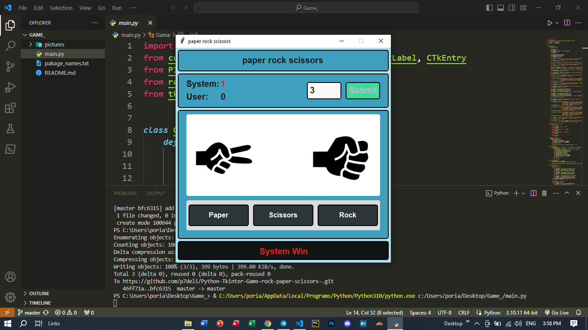

# Hello Welcome ...
## Libraries used in this project 
### 1.Customtkinter
### 2.Tkinter
### 3.Pillow
### 4.Random

<h2 style="color: red; font-size: 30px;">Install these packages to run the program</h2>
